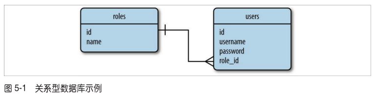
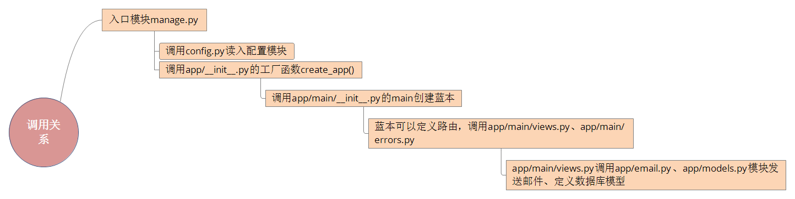

# Flask入门学习笔记
**配合《Flask Web开发：基于Python的Web应用开发实战》学习**

## **chapter 1**
### 虚拟环境virtualenv
1. 安装virtualenv包：`$ sudo apt-get install python-virtualenv`
2. 创建虚拟环境：`$ virtualenv venv`
3. 激活虚拟环境：`$ source venv/bin/activate`
4. 退出虚拟环境：`$ deactivate`

### Flask
1. 安装Flask：`(venv) $ pip install flask`
2. 检查Flask是否安装正确：
```
(venv) $ python
>> import flask
>> 
```
没有看见错误证明Flask安装正确

## **chapter 2**
### Jinja2模板引擎
>为了分离业务逻辑和表现逻辑，一般使用模板，模板是一个包含响应文本的文件，用占位符表示动态部分，渲染就是用真实值替换变量，再返回最终得到的响应字符串，Flask使用Jinja2模板引擎渲染模板。

Jinja2提供很多过滤器来修改变量，**注意：千万别在不可信的值上使用safe过滤器，例如用户在表单中输入的文本**

## **chapter 3**
### Bootstrap
>Bootstrap是Twitter开发的一个开元框架，提供的用户组界面可用于创建整洁且具有吸引力的网页。

1. 安装Bootstrap:`(venv) $ pip install flask-bootstrap`

**模板的继承**

语法：``

**模板继承的一个例子**

基模板中定义了如下block：
```

<div class="container">
    
</div>

```
衍生模板继承：
```

<div class="page-header">
    <h1>Not Found</h1>
</div>

```
效果等同于：
```

<div class="container">
    <div class="page-header">
        <h1>Not Found</h1>
    </div>
</div>

```

**链接**

`url_for()`函数可以利用视图函数名生成URL信息，例如：
>在当前版本的`hello.py`程序中调用`url_for('index')`得到的结果是`/`。调用`url_for('index', _external=True)`返回的则是绝对地址，在这个示例中是`http://localhost:5000/` 。

**静态文件**

对静态文件的引用会被当成一个特殊路由，不需要编写相应的视图函数，例如：
>调用`url_for('static', filename='css/styles.css', _external=True)`得到的结果是`http://localhost:5000/static/css/styles.css` 。

>默认设置下，Flask在程序根目录中名为`static`的子目录中寻找静态文件。如果需要，可在`static`文件夹中使用子文件夹存放文件。服务器收到前面那个URL后，会生成一个响应，包含文件系统中`static/css/styles.css`文件的内容。

>**注意：要使用super()保留基模板中定义的块的原始内容（虽然还不太理解，但被这个坑了一下，没有super()样式就全乱了）。**

**使用Flask-Moment本地化日期和时间**

为了在服务器使用统一的时间，而用户浏览器看到的是本地化的时间，利用开源库`moment.js`在浏览器中渲染日期和日期，Flask-Moment是封装`moment.js`的一个Flask扩展。

1. 安装Flask-Moment扩展:`(venv) $ pip install flask-moment`

## **chapter 4**
### Web表单
>生成表单的HTML代码和验证提交表单的数据是一些很单调的任务，Flask-WTF扩展可以简化这些过程。

1. 安装Flask-WTF扩展:`(venv) $ pip install flask-wtf`
2. 设置密匙以防止跨站请求伪造的攻击:`app.config['SECRET_KEY'] = 'hard to guess string'`

**表单类**

>使用Flask-WTF时，每个Web表单都由一个继承自Form的类表示。这个类定义表单中的一组字段，每个字段都用对象表示。字段对象可附属一个或多个验证函数。验证函数用来验证用户提交的输入值是否符合要求。

>例如`StringField('What is your name?', validators=[Required()])`,validators指定一个由验证函数组成的**列表**，在接受用户提交的数据之前验证数据。

>Form基类由Flask-WTF扩展定义，从flask.ext.wtf中导入；字段和验证函数直接从WTForms导入：
```
from flask.ext.wtf import Form
from wtforms import StringField, SubmitField
from wtforms.validators import Required
```

**把表单渲染成HTML**

>当浏览器请求页面时，显示表单的一种方法是利用视图函数把一个`NameForm`类实例通过参数form传入模板，在模板中生成一个简单的表单，但是这种方式太过繁琐。尽量使用Bootstrap中的表单样式，利用Flask-Bootstrap提供的一个非常高端的辅助函数渲染整个Flask-WTF表单：
```

{{ wtf.quick_form(fomr) }}
```

**在视图函数中处理表单**

* 提交表单通常使用`post`的方式。
* `NameForm`类实例的`validate_on_submit()`方法在所有验证函数通过时返回True。

<font color="red">如果服务器收到一个没有表单数据的GET请求，validate_on_submit()函数将返回False。</font>

**重定向和用户会话**

刷新页面时浏览器会重新发送之前已经发送的最后一个请求，如果这是一个post请求，刷新页面就会重新post，可以使用Post/重定向/Get模式这种技巧。但是这种方式的缺点时会丢失上一次post的数据，可以使用通过session在请求之间”记住“数据。

**Flash消息**

在模板中取flash消息:``，使用循环的原因是可能有多个消息在排队等待显示，这个应该是获取消息队列中的下一个消息。

`get_flashed_messages()`函数刷新之后不会再次返回，所以刷新之后flash消息会消失。书上面的这两句话没有因果关系，搞得我看了半天:
>在模板中使用循环是因为在之前的请求循环中每次调用`flash()`函数时都会生成一个消息，所以可能有多个消息在排队等待显示。`get_flashed_messages()`函数获取的消息在下次调用时不会再次返回，因此Flash消息只显示一次，然后就消失了。

## **chapter 5**
### 数据库
>Web程序最常用基于关系模型的数据库，这种数据库也称为SQL数据库，因为它们使用结构化查询语言。不过最近几年文档数据库和键值对数据库成了流行的替代选择，这两种数据库合称NoSQL数据库。

<font color="red">第一次看这章，看不太懂，不知道在讲什么，估计是因为我对数据库的一些概念还不太了解吧。以下笔记来自第二次阅读。</font>

**SQL数据库**

**主键**用于唯一标识某一行，**外键**用于引用同一个表或不同表中某行的主键。

SQL数据库复杂的地方是需要将表联结起来，优点是存储数据高效，能避免重复。

**NoSQL数据库**

>NoSQL数据库一般使用集合代替表，使用文档代替记录。

<font color="red">当前还不是很理解上面这句话。</font>

>NoSQL数据库所采用的设计方式使联结变得困难，所以大多数数据库根本不支持这种操作。

**Python数据库框架**

SQLAlchemy是一个数据库抽象层代码包，初步理解是为多种数据库引擎提供抽象层，使得应用不用处理底层的数据库实体<font color="red">（可能理解有误）</font>。

>抽象层，也称为对象关系映射（Object-Relational Mapper, ORM）或对象文档映射（Object-Document Mapper, ODM）。

**使用Flask-SQLAlchemy管理数据库**
>Flask-SQLAlchemy是一个Flask扩展，简化了在Flask程序中使用SQLAlchemy的操作。SQLAlchemy是一个很强大的关系型数据库框架，支持多种数据库后台。SQLAlchemy提供了高层ORM，也提供了使用数据库原生SQL的低层功能。

1. 安装Flask-SQLAlchemy:`(venv) $ pip install flask-sqlalchemy`

**定义模型**



示例，定义Role和User模型：
```
class Role(db.Model):
    __tablename__ = 'roles'
    id = db.Column(db.Integer, primary_key = True)
    name = db.Column(db.String(64), unique = True)
    
    def __repr__(self):
        return '<Role %r>' % self.name

class User(db.Model):
    __tablename__ = 'users'
    id = db.Column(db.Integer, primary_key = True)
    username = db.Column(db.String(64), unique = True, index = True)
    
    def __repr__(self):
        return '<User %r>' % self.username
```
>类变量`__tablename__`定义在数据库中使用的表名。

>db.Column类构造函数的第一个参数是数据库列和模型属性的类型，其余参数指定属性的配置选项，比如`primary_key=True`表明这列是表的主键。

**关系**

示例，关系：
```
class Role(db.Model):
    # ...

class User(db.Model):
    # ...
    role_id = db.Column(db.Integer, db.ForeignKey('roles.id'))
```
>添加到User模型中的role_id列被定义为外键，传给db.ForeignKey()的参数'roles.id'表明，这列的值是roles表中行的id值。

>db.relationship()中的backref参数向User模型中添加一个role属性，定义反向关系<font color='red'>（当前对于这句话不是太理解）</font>。这一属性可替代role_id访问Role模型，此时获取的是模型对象，而不是外键的值。

<font color='red'>另外书中关于其他的关系类型描述那段话也还不太理解。</font>

**数据库操作**

1.创建表：
```
启动python shell：
(venv) $ python hello.py shell
>>> from hello import db
>>> db.create_all()
```
2.添加一些角色和用户：
```
>>> from hello import Role, User
>>> admin_role = Role(name = 'Admin')
>>> user_role = Role(name = 'User')
>>> user_john = User(username = 'susan', role = user_role)
```
3.添加到会话并提交会话以把对象写入数据库：
```
>>> db.session.add(admin_role)
>>> db.session.add(user_role)
>>> db.session.add(user_john)
>>> db.session.commit()
```

4.查询行：
```
>>> Role.query.all()
>>> User.query.all()
```
5.通过过滤器更精确查询行：
```
>>> User.query.filter_by(role=user_role).all()
```

关于查询的另外一个示例：
```
>>> user_role = Role.query.filter_by(name = 'User').first()
```
以上返回一个更精确的query对象。
```
>>> users = user_role.users
```
`user_role.users`表达式隐含的查询会调用all()返回一个用户列表，但无法指定更精确的查询过滤器。解决方法：修改关系设置，加入`lazy='dynamic'`参数，从而禁止自动查询：
```
class Role(db.Model):
    # ...
    users = db.realtionship('User', backref = 'role', lazy = 'dynamic')
    # ...
```
配置之后，user_role.users会返回一个尚未执行的查询，因此可以在其上添加过滤器：
```
>>> user_role.users.order_by(User.username).all()
```

**在视图函数中操作数据库**

更新`hello.py`：
```
@app.route('/', methods = ['GET', 'POST'])
def index():
    form = NameForm()
    if form.validate_on_submit():
        user = User.query.filter_by(username = form.name.data).first()
        if user is None:
            user = User(username = form.name.data)
            db.session.add(user)
            # 注意书中少的以下这句，经过测试，需要commit才能写入数据库
            db.session.commit()
            session['known'] = False
        else:
            session['known'] = True
        session['name'] = form.name.data
        return redirect(url_for('index'))
    return render_template('index.html', form = form, name = session.get('name'),
                           known = session.get('known', False))
```
更新`index.html`模板：
```



Flasky


<div class="page-header">
    <h1>Hello, {{ name }}Stranger!</h1>
    
    <p>Pleased to meet you!</p>
    
    <p>Happy to see you again!</p>
    
</div>
{{ wtf.quick_form(form) }}

```

**集成Python shell**

集成的目的是为了偷懒，不用每次启动Python shell创建数据库或插入行都要`import db, Role, User`，方法：为shell命令注册一个make_context()回调函数：
```
from flask.ext.script import Shell
def make_shell_context():
    return dict(app = app, db = db, User = User, Role = Role)
manager.add_command("shell", Shell(make_context = make_shell_context))
```

**使用Flask-Migrate实现数据库迁移**
>Flask-Migrate扩展对数据库迁移框架Alembic做了轻量级包装。

安装Flask-Migrate:`(venv) $ pip install flask-migrate`

1.创建迁移仓库：
```
(venv) $ python hello.py db init
```

2.创建迁移脚本：
```
(venv) $ python hello.py db migrate -m "initial migration"
```
以上会报一个warning：
```
UserWarning: SQLALCHEMY_TRACK_MODIFICATIONS adds significant overhead and will be disabled by default in the future.  Set it to True to suppress this warning.
```
消除warning的方法：修改`venv/lib/python2.7/site-packages/flask_sqlalchemy/__inin__.py`第797行，将`track_modifications = app.config.setdefault('SQLALCHEMY_TRACK_MODIFICATIONS', None)`中的`None`改成`True`。

3.更新数据库：
```
(venv) $ python hello.py db upgrade
```

<font color='color'>注意：以上数据库的迁移我执行后有问题，貌似创建的时候就出问题了，恢复不了，暂时不清楚为什么。</font>

## **chapter 6**
### **电子邮件**

相对来说这一章比较简单

在程序中发送电子邮件：
```
from flask.ext.mail import Message

app.config['MAIL_SERVER'] = 'smtp.163.com'
app.config['MAIL_PORT'] = 25
app.config['MAIL_USE_TLS'] = True
app.config['MAIL_USERNAME'] = os.environ.get('MAIL_USERNAME')
app.config['MAIL_PASSWORD'] = os.environ.get('MAIL_PASSWORD')
app.config['FLASKY_MAIL_SUBJECT_PREFIX'] = '[Flasky]'
app.config['FLASKY_MAIL_SENDER'] = os.environ.get('MAIL_SENDER')
app.config['FLASKY_ADMIN'] = os.environ.get('FLASKY_ADMIN')

def send_async_email(app, msg):
    with app.app_context():
        mail.send(msg)

def send_email(to, subject, template, **kwargs):
    msg = Message(app.config['FLASKY_MAIL_SUBJECT_PREFIX'] + subject, 
                  sender = app.config['FLASKY_MAIL_SENDER'], recipients=[to])
    msg.body = render_template(template + '.txt', **kwargs)
    msg.html = render_template(template + '.html', **kwargs)
    thr = Thread(target = send_async_email, args = [app, msg])
    thr.start()
    return thr
    
@app.route('/', methods = ['GET', 'POST'])
def index():
    form = NameForm()
    if form.validate_on_submit():
        user = User.query.filter_by(username = form.name.data).first()
        if user is None:
            # ...
            if app.config['FLASKY_ADMIN']:
                send_email(app.config['FLASKY_ADMIN'], 'New User',
                           'mail/new_user', user = user)
            # ...
```

发送邮件移到线程里面去执行，缺点是每一个邮件都要新建一个线程不太合适，改进方法是将`send_async_email()`函数的操作发给Celery任务队列。

<font color='red'>上面使用了网易的smtp服务器，偶尔能发送成功，经常抽风，不知道为什么，账户、密码、发件邮箱地址、收件邮箱地址都从环境变量中读入。</font>

## **chapter 7**
### **大型程序的结构**
<font color='red'>第一次看这章，看得云里雾里，蓝本的概念不知道讲的什么。对整个结构理解很乱，这种感觉就像按照前面的步骤装好了一个玩具，然后把它拆散，再装一个功能一样但外形不一样的玩具，模块与模块之间怎么耦合一下子完全没有概念。</font>

前后来回看了5次这章，终于稍微清晰了一点，目录结构如下：
```
.
├── app
│   ├── email.py
│   ├── __init__.py
│   ├── main
│   │   ├── errors.py
│   │   ├── forms.py
│   │   ├── __init__.py
│   │   └── views.py
│   ├── models.py
│   ├── static
│   │   └── favicon.ico
│   └── templates
│       ├── 404.html
│       ├── 500.html
│       ├── base.html
│       ├── index.html
│       ├── mail
│       │   ├── new_user.html
│       │   └── new_user.txt
│       └── user.html
├── config.py
├── manage.py
├── migrations
│   ├── alembic.ini
│   ├── env.py
│   ├── README
│   ├── script.py.mako
│   └── versions
├── readme.md
├── requirements.txt
├── sqlite-example.png
└── tests
    ├── __init__.py
    └── test_basics.py
```
大致调用关系图如下：


总体来说这章讲得有点混乱，要多读几次，但其实结构也不是很复杂。暂时理解蓝本的作用：在创建app之后定义路由。

**一些需要注意的地方：**

1.配置可以使用Flask app.config配置提供的from_object()方法直接导入程序：
```
def create_app(config_name):
    app = Flask(__name__)
    app.config.from_object(config[config_name])
    config[config_name].init_app(app)
    # ...
```
其中`config[config_name].init_app(app)`当前定义为空。

书中未给出的几个文件源码如下：

app/email.py:
```
from threading import Thread
from flask.ext.mail import Mail
from flask.ext.mail import Message
from flask import current_app, render_template
from . import mail

def send_async_email(app, msg):
    with app.app_context():
        mail.send(msg)

def send_email(to, subject, template, **kwargs):
    app = current_app._get_current_object()
    msg = Message(app.config['FLASKY_MAIL_SUBJECT_PREFIX'] + subject, 
                  sender = app.config['FLASKY_MAIL_SENDER'], recipients=[to])
    msg.body = render_template(template + '.txt', **kwargs)
    msg.html = render_template(template + '.html', **kwargs)
    thr = Thread(target = send_async_email, args = [app, msg])
    thr.start()
    return thr
```
**以上要注意的一点是`from flask import current_app`和`app = current_app._get_current_object()`这一句，原来的直接引用app在这里会报错，因为app未定义，app/main/views.py里面的app也要改成current_app。current_app应该是程序上下文，还不怎么理解。**

app/models.py:
```
from . import db

class Role(db.Model):
    __tablename__ = 'roles'
    id = db.Column(db.Integer, primary_key = True)
    name = db.Column(db.String(64), unique = True)
    users = db.relationship('User', backref = 'role', lazy = 'dynamic')
    
    def __repr__(self):
        return '<Role %r>' % self.name

class User(db.Model):
    __tablename__ = 'users'
    id = db.Column(db.Integer, primary_key = True)
    username = db.Column(db.String(64), unique = True, index = True)
    role_id = db.Column(db.Integer, db.ForeignKey('roles.id'))
    
    def __repr__(self):
        return '<User %r>' % self.username
```

程序默认使用`DevelopmentConfig`配置，数据库需要自己创建，但这个目录结构在shell中创建数据库非常麻烦，因为db未初始化，这跟之前的第5章不同。这里直接使用第5章的数据库文件就ok，名字改成`data-dev.sqlite`。

在运行时需要设置的环境变量（Linux系统，替换下面的*，但是没什么卵用，163邮箱继续抽风）：
```
export MAIL_SENDER=*****
export FLASKY_ADMIN=*****
export MAIL_USERNAME=*****
export MAIL_PASSWORD=*****
```

******
**2016年5月15日更新**

找到原因了，邮件发不出去是因为网易smtp服务器把这当成了垃圾邮件，看这错误：
```
SMTPDataError: (554, 'DT:SPM 163 smtp9,DcCowABnlycHFDhXNLdrAA--.30082S3 1463292937,please see http://mail.163.com/help/help_spam_16.htm?）
```
貌似网易还会封一段时间ip（晕）。so，暂时把邮件功能屏蔽掉，看来邮件这个问题是个不小的问题啊。
******

最后的单元测试看不太懂，主要是程序上下文的理解。`setUp()`和`tearDown()`方法分别在测试前后运行，以test开头的方法都是测试方法。以下这句测试的是什么？
```
self.assertTrue(current_app.config['TESTING'])
```
书中一句带过，`确保程序在测试配置中运行`？

关于单元测试的更多内容，可以参考这里：http://www.liaoxuefeng.com/wiki/001374738125095c955c1e6d8bb493182103fac9270762a000/00140137128705556022982cfd844b38d050add8565dcb9000