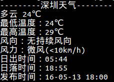

SimpleWeather-C是一个命令行查询天气的小工具，使用的是百度API Store的接口，当前还未完善，只能固定查询深圳的天气，后续会加上其他城市以及查询多天的天气的一些选项。

**How to play：**

1.在当前文件夹下新建一个`app_config.txt`文件，在里面按照这个格式把‘*’替换成你申请的百度的appid：
```
apikey:************
```
2.执行 `sh build.sh`，编译依赖的curl库及源程序。

3.执行`./get_weather`，返回当前深圳天气：

